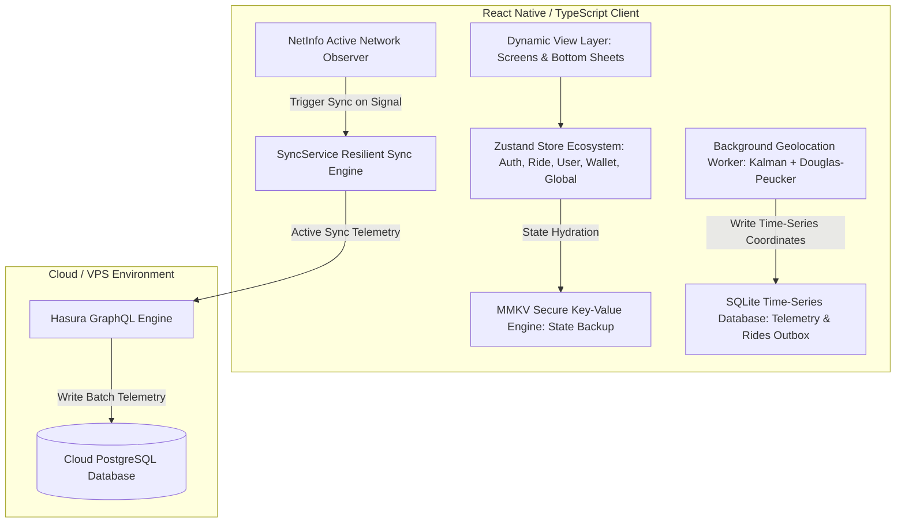
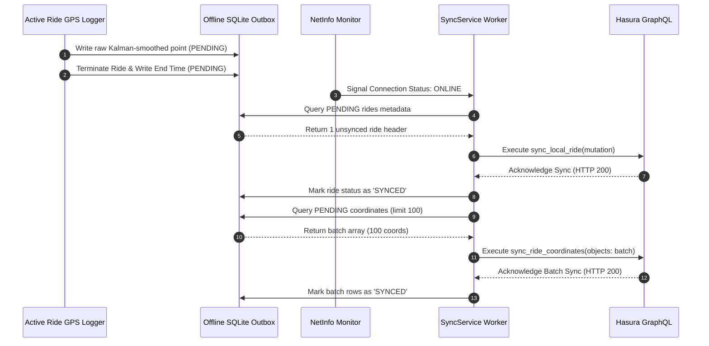

# Technical Architecture Spec — Sidekick Engine

---

## 1. System Topology Overview

The Sidekick mobile engine leverages a **local-first, reactive architecture** designed to isolate the client interface from network latency and sync failures.



---

## 2. Advanced Geolocation Telemetry Framework

The Sidekick geolocation pipeline is designed to eliminate high-frequency GPS noise (multi-path reflections, satellite search jitter) and downsample high-density paths to minimize network transmission costs and client-side SVG rendering load.

### A. Geodesic Distance (Haversine Formula)
To calculate precise travel distance over the earth's curvature between consecutive telemetry updates:

$$\Delta\sigma = 2 \arcsin \left( \sqrt{\sin^2\left(\frac{\Delta\phi}{2}\right) + \cos(\phi_1)\cos(\phi_2)\sin^2\left(\frac{\Delta\lambda}{2}\right)} \right)$$

$$d = R \cdot \Delta\sigma$$

Where:
* $\phi_1, \phi_2$ are latitudes in radians.
* $\Delta\phi$ is latitude difference, $\Delta\lambda$ is longitude difference.
* $R$ is the Earth's radius ($6,371,000 \text{ meters}$).

### B. Kalman Geolocation Noise Filtering
Raw GPS coordinate feeds ($\mathbf{z}_k$) are processed through a linear Kalman filter modeled on constant-velocity dynamics. 

1. **State Prediction:**
   $$\mathbf{\hat{x}}_{k\mid k-1} = \mathbf{F}_k \mathbf{\hat{x}}_{k-1\mid k-1}$$
   $$\mathbf{P}_{k\mid k-1} = \mathbf{F}_k \mathbf{P}_{k-1\mid k-1} \mathbf{F}_k^T + \mathbf{Q}_k$$

2. **Measurement Update:**
   $$\mathbf{y}_k = \mathbf{z}_k - \mathbf{H}_k \mathbf{\hat{x}}_{k\mid k-1}$$
   $$\mathbf{S}_k = \mathbf{H}_k \mathbf{P}_{k\mid k-1} \mathbf{H}_k^T + \mathbf{R}_k$$
   $$\mathbf{K}_k = \mathbf{P}_{k\mid k-1} \mathbf{H}_k^T \mathbf{S}_k^{-1}$$
   $$\mathbf{\hat{x}}_{k\mid k} = \mathbf{\hat{x}}_{k\mid k-1} + \mathbf{K}_k \mathbf{y}_k$$
   $$\mathbf{P}_{k\mid k} = (\mathbf{I} - \mathbf{K}_k \mathbf{H}_k) \mathbf{P}_{k\mid k-1}$$

Where:
* State Vector $\mathbf{x} = [\text{lat}, \text{lng}, v_{\text{lat}}, v_{\text{lng}}]^T$.
* $\mathbf{P}$ is the estimation error covariance.
* $\mathbf{R}$ is the measurement noise variance (derived dynamically from the GPS sensor's horizontal accuracy radius).
* $\mathbf{Q}$ is the process noise covariance (modeling acceleration limits of the vehicle).

### C. Downsampling (Douglas-Peucker Algorithm)
To shrink the coordinate payload size by $\sim 70\%$ for SVG path drawing and bulk-insert operations without losing structural details, coordinates are downsampled based on perpendicular distance thresholds:

```
                  P (max distance point)
                 / \
                /   \     d > threshold (keep P)
               /     \
  Start (A) --------------------- End (B)
```

1. Find the point $P$ furthest from the line segment $AB$ joining the trajectory endpoints.
2. If perpendicular distance $d > \epsilon$ (perpendicular tolerance threshold):
   * Recursively split the segment at $P$.
   * Run Douglas-Peucker on $AP$ and $PB$.
3. If $d \leq \epsilon$:
   * Discard all intermediate points between $A$ and $B$.

---

## 3. Resilient Outbox & Batch Synchronization Patterns

### SQLite Off-line Outbox Schemas
The client uses two primary tables to guarantee offline resilience:

```sql
CREATE TABLE IF NOT EXISTS rides (
  id TEXT PRIMARY KEY,
  scooter_id TEXT,
  start_time TEXT,
  end_time TEXT,
  status TEXT DEFAULT 'ACTIVE',
  total_distance REAL DEFAULT 0.0,
  sync_status TEXT DEFAULT 'PENDING'
);

CREATE TABLE IF NOT EXISTS coordinates (
  id TEXT PRIMARY KEY,
  ride_id TEXT,
  latitude REAL,
  longitude REAL,
  altitude REAL,
  speed REAL,
  accuracy REAL,
  timestamp INTEGER,
  sync_status TEXT DEFAULT 'PENDING',
  FOREIGN KEY(ride_id) REFERENCES rides(id) ON DELETE CASCADE
);
```

### Batch Sync Lifecycle Sequence



---

## 4. store-Decoupling & Circular Dependency Resolution

### The Dynamic Callback Register Pattern
To prevent Metro circular reference crashes (e.g. `utils/client.ts` importing `AuthStore` to get the JWT token, while `AuthStore` imports `utils/client.ts` to initialize the client), the engine implements a **dynamic callback registry**:

```typescript
// utils/client.ts (Decoupled Module)
let getGraphQLClientCallback: (() => Client | null) | null = null;

export const setGraphQLClientGetter = (callback: () => Client | null) => {
  getGraphQLClientCallback = callback;
};

export const callMutation = async (args: Args) => {
  const client = getGraphQLClientCallback ? getGraphQLClientCallback() : null;
  if (!client) throw new Error('GraphQL client not initialized');
  // ... execute mutation
};
```

During store initialization:
```typescript
// modules/authentication/store/index.ts
import { setGraphQLClientGetter } from '@/utils/client';

const authStore = create<AuthStore>(set => ({
  graphQLClient: null,
  // ... store actions
}));

// Register getter dynamically to break circular reference chain
setGraphQLClientGetter(() => authStore.getState().graphQLClient);
```

---

## 5. Theme Token Specs & Slate-Navy Dark Mode

The styling ecosystem utilizes Zustand-tracked theme tokens to support instantaneous dynamic style evaluations across views:

```typescript
export const darkColors = {
  primary: '#0DF073',      // Soothing premium green
  secondary: '#72FFB1',    // Soft pale green
  highlight: '#4382FF',    // Slate blue accent
  error: '#F84848',        // Coral red
  alert: '#2C1A20',        // Deep ruby warning background
  lightGray: '#24283B',    // Soft grey-blue border surface
  textPrimary: '#E2E5F0',  // Soft off-white
  textSecondary: '#7A849E',// Legible grey-blue
  blueFade: '#1B2032',     // Rich deep blue tint
  redFade: '#25181D',      // Rich deep red tint
  white: '#1A1D29',        // Slate card background
  appBaseBg: '#12141C',    // Soothing dark navy background
};
```
