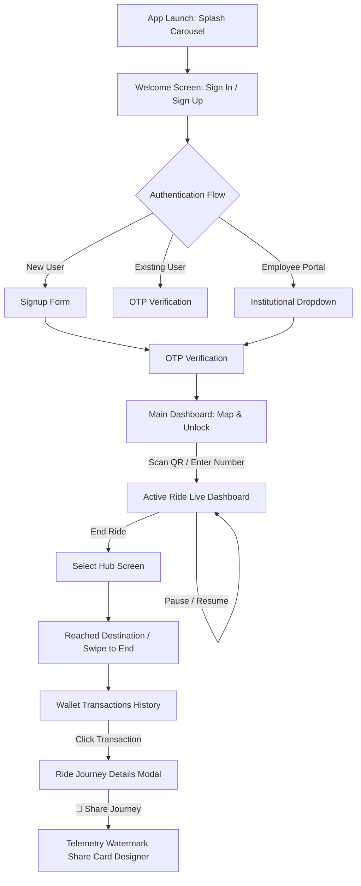

# Product Requirement Document (PRD) — Sidekick Micromobility

---

## 1. Product Vision & Goal
Sidekick is a premium, ultra-responsive, and resilient micromobility/scooter-sharing application designed for urban commuters, enterprise employees, and university campus riders. 

The application is built on a **local-first, connection-resilient** product paradigm: riders can effortlessly unlock vehicles, monitor active riding metrics, view smooth GPS maps, and review complex historical statistics with zero-latency, even under extreme signal drops or spotty cellular connectivity. The product aims to feel premium, featuring a soothing Slate-Navy aesthetic and highly engaging social integrations (Strava-style telemetry sharing cards).

---

## 2. Key Target Features

### A. Seamless Onboarding & Smart Authentication
* **Dynamic Welcome Funnel:** An educational multi-page interactive onboarding carousel introducing riders to proper scooter handling, braking guidelines, and safety policies.
* **Resilient Dual-State Auth:** Zero-network sandbox bypass logic for physical simulators and remote testers alongside enterprise employee institution sign-in portals.
* **Map Dimming Mode:** Sophisticated map background overlays that intelligently dim bright street graphics in dark mode to guarantee text legibility and mitigate night-time eye fatigue.

### B. High-Precision Live Ride Dashboard
* **Dynamic Dashboard:** A state-of-the-art live map display with real-time stats including elapsed time (`mm:ss`), distance logged (`km`), current speed (`km/h`), and active cost estimations (`₹` or `Credits`).
* **Offline-Resilient Local Caching:** Live trajectory points are captured and stored in a local MMKV time-series buffer in real-time. If the JS runtime resets or the app is closed, the active ride state is rehydrated instantly with no data loss.

### C. Outbox Synchronization Engine
* **Resilient Outbox Pattern:** All metadata and telemetric coordinates are written to a localized SQLite/MMKV database first.
* **Intelligent Network Sync:** An active NetInfo connection monitor detects signal restoration, triggering an outbox flush that packages and bulk-inserts coordinate coordinates using Hasura GraphQL endpoints.
* **Exponential Backoff:** If synchronization fails due to server load or network timeouts, the sync worker executes a smart exponential backoff strategy (base 2s scaling to a max of 60s limit).

### D. Strava-Style Telemetry Share Cards
* **Customizer Canvas Engine:** An advanced compositing engine allowing riders to snap a live photo of their trip or choose from beautiful, premium gradient backdrop presets.
* **Watermark Overlay:** The system automatically overlays the glowing route path geometry and journey metrics (top speed, average speed, trip cost, duration, and date) onto the backdrop.
* **Native OS Sharing:** Packages the compiled base64 watermarked image into a high-fidelity JPEG and invokes the native OS sharing sheet.

### E. Premium Slate-Navy Theme System
* **Slate-Dark Architecture:** High-contrast dynamic themes that replace raw white screens with soothing Slate and Dark-Navy colors (`#12141C` base background with `#1A1D29` indigo-grey card surfaces).
* **Responsive Bottom Sheets:** Transition-rich sliding panels for authentication forms and ride actions that match the active theme.

---

## 3. High-Fidelity User Flows

---

## 4. Feature Specifications & UX Metrics

| Feature | Primary Goal | User Experience Requirement |
| :--- | :--- | :--- |
| **Active Ride Screen** | Provide live trip telemetry. | Responsive time-cost updating at a strict 1Hz frequency. |
| **GPS Telemetry Logger** | Capture ride coordinates accurately. | Strict background thread persistence that operates with the screen off. |
| **Synchronizer Outbox** | Upload offline queues to Hasura. | Zero-friction background threads. Must never freeze the main thread. |
| **Watermarker Card** | Compile shareable trip graphics. | Render base64 visual composites in under 2 seconds on midrange devices. |
| **Slate-Dark Theme** | Soothe rider eyes during night rides. | Dynamic hex switches completed under 16ms (1 frame at 60Hz). |

---

## 5. Non-Functional Requirements & Security
* **Data Integrity:** Client outboxes must persist telemetric coordinates locally for up to 30 days if the device remains completely offline.
* **Local-First Security:** Telemetry databases must run in the application sandboxed sandbox container, protecting personal location logs from third-party client inspections.
* **Bypass Safety:** Sandbox mock numbers (e.g. `9876543210`) must be strictly stripped out or conditioned out in official production builds.
